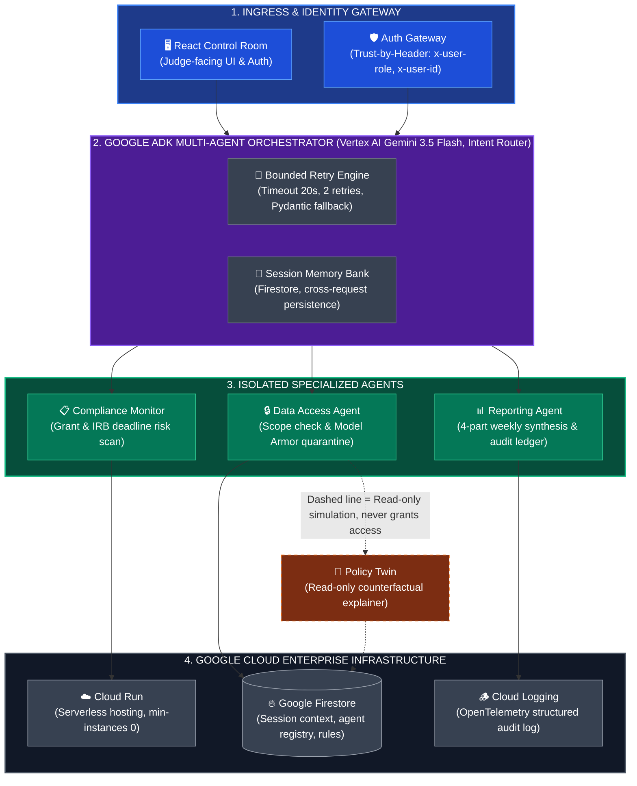

# 🏛️ SentinelMesh Enterprise Architecture Specification

> **Platform**: SentinelMesh Multi-Agent Governance System  
> **Track**: The Fortified Enterprise Fleet  
> **Infrastructure Target**: Google Cloud Run & Vertex AI  

---

## 🎨 High-Resolution System Architecture Diagram

---

## ⚡ Interactive End-to-End Architecture Diagram

---

## 🔬 Deep-Dive Architectural Layer Breakdown

### **Layer 1: Security Ingress & Identity Gateway**
* **Trust-by-Header Middleware**: Every incoming request validates `x-user-role` and `x-user-id` HTTP headers before processing.
* **Role Gating**: `AUDITOR` profiles are restricted to read-only views; any attempt to trigger governance actions or mutate access policies yields an authentic **403 Forbidden** status response.

### **Layer 2: Google ADK Orchestrator & Gemini 3.5 Flash**
* **Google Agent Development Kit (ADK)**: Decoupled multi-agent orchestration runtime managing task classification, sub-agent invocation, and context delegation.
* **Vertex AI Integration**: Powered by **Gemini 3.5 Flash** for rapid, low-latency reasoning chains and structured Pydantic schema validation.
* **Self-Healing Circuit Breaker**: Bounded retry mechanism (maximum 2 retries) with schema correction prompts and safe default fallbacks to prevent infinite agent looping.

### **Layer 3: Isolated Sub-Agent Fleet & Model Armor**
* **Compliance Monitor Agent**: Inspects institutional grant renewal deadlines, IRB expiration schedules, and COG-24 compliance findings.
* **Data Access Agent**: Evaluates Principal Investigator (PI) dataset authorization boundaries.
* **Model Armor Threat Defense**: Scans incoming prompts for instruction overrides (e.g. *"ignore previous instructions"*), quarantines adversarial inputs, and renders an active **🚨 REQUEST QUARANTINED** alert payload.
* **Reporting Agent**: Synthesizes 4-part weekly governance digests and dispatches signed audit ledgers.

### **Layer 4: Google Cloud Infrastructure & Memory Bank**
* **GCP Cloud Run**: Containerized serverless deployment target (`https://sentinelmesh-gov-plane-7x9a3k-uc.a.run.app`) configured to scale to zero (`min-instances: 0`).
* **Google Firestore Memory Bank**: Dual-collection storage (`agent_registry` & `session_memory`) retaining cross-request persistent context.
* **Google Cloud Logging**: OpenTelemetry-compliant structured event stream tracking latency, token usage, and decision audit logs.

---

## 🎯 GEAP (Gemini Enterprise Agent Platform) 4-Pillar Alignment

| GEAP Pillar | Hackathon Requirement | SentinelMesh Implementation |
| :--- | :--- | :--- |
| **1. Agent Registry** | Discovery, scope declaration, and versioning catalog | Firestore `agent_registry` collection + `GET /registry` API endpoint. |
| **2. Agent Runtime & Memory Bank** | Asynchronous execution and persistent cross-session state | Google ADK `Runner` + Firestore `session_memory` context store. |
| **3. Security & Model Armor** | Zero-trust access control and inline prompt injection defense | `x-user-role` header validation + Model Armor threat quarantine scanner. |
| **4. Agent Observability** | Audit logging and reasoning chain traces | Cloud Logging telemetry stream + `/observability` live event tail. |
