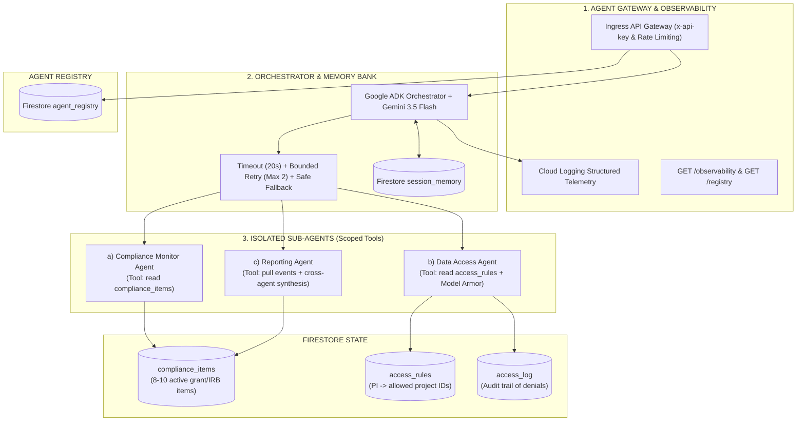

# SentinelMesh — Multi-Agent Enterprise Governance System

> **Track**: Fortified Enterprise Fleet  
> **Target User**: Resource-constrained institution (campus research lab) managing multi-week grant compliance, IRB deadlines, and cross-PI data access — an "unlikely hero" use case with zero enterprise budget.

---

## 🏛️ Architecture & GEAP Pillar Mapping



---

## 🎯 GEAP Pillar Implementation Matrix

| GEAP Pillar | Requirement | Code Implementation & Location |
| --- | --- | --- |
| **Agent Registry** | Discoverable collection of active agents, versioning, declared scopes, and tools | Firestore `agent_registry` collection. Read endpoint `GET /registry` in [`main.py`](file:///d:/SentinelMesh-Governance-Platform/gcp/sentinelmesh/main.py#L573-L576). |
| **Agent Runtime & Memory Bank** | ADK Orchestrator, session memory persisting across restarts | Google ADK `Agent` & `Runner` in [`main.py`](file:///d:/SentinelMesh-Governance-Platform/gcp/sentinelmesh/main.py#L177-L195). Persistent `session_memory` in Firestore. |
| **Model Armor & Isolation** | Scope-restricted sub-agents, instruction sanitization, privilege quarantine | Scoped tools in [`main.py`](file:///d:/SentinelMesh-Governance-Platform/gcp/sentinelmesh/main.py#L219-L275), Model Armor pattern scanner & Policy Twin in [`policy.py`](file:///d:/SentinelMesh-Governance-Platform/gcp/sentinelmesh/policy.py#L9-L68). |
| **Observability & Gateway** | Single ingress API key authentication, rate-limiting, Cloud Logging traces | `require_api_key` middleware, Cloud Logging structured telemetry in [`main.py`](file:///d:/SentinelMesh-Governance-Platform/gcp/sentinelmesh/main.py#L510-L532), `GET /observability`. |
| **Failure Handling & Recovery** | Bounded retry (max 2), schema validation, safe default fallback, never crash | `run_with_recovery` wrapper in [`main.py`](file:///d:/SentinelMesh-Governance-Platform/gcp/sentinelmesh/main.py#L453-L481). |

---

## ⚡ Exact GCP Spin-up Steps

```bash
# 1. Configure Environment
export GCP_PROJECT_ID="your-gcp-project-id"
export GOOGLE_CLOUD_LOCATION="us-central1"
export SENTINELMESH_API_KEY="$(openssl rand -hex 24)"
export GEMINI_MODEL="gemini-3.5-flash"

# 2. Authenticate Google Cloud SDK
gcloud auth login
gcloud auth application-default login
gcloud config set project "$GCP_PROJECT_ID"

# 3. Create Python Virtual Environment & Install Dependencies
cd gcp/sentinelmesh
python -m venv .venv
# On Linux/macOS: source .venv/bin/activate
# On Windows PowerShell: .venv\Scripts\Activate.ps1
pip install -r requirements.txt

# 4. Seed Firestore collections (agent_registry, compliance_items, access_rules)
python seed_firestore.py

# 5. Deploy Orchestrator to Cloud Run
chmod +x deploy.sh
./deploy.sh
```

---

## 🔍 Findings and Learnings

1. **Schema Validation is the Primary Safety Boundary**: A model timeout is easily handled, but accepting malformed structured output as valid is catastrophic. SentinelMesh enforces Pydantic schema validation before persisting or acting on any output.
2. **Bounded Retry Prevents Infinite Drift**: SentinelMesh bounds retries to exactly 2 attempts with corrective prompt injection. If the model still fails schema validation, it gracefully degrades to a safe schema-valid fallback default without crashing.
3. **Model Armor Requires Deterministic Isolation**: Language models should never evaluate raw instruction text when deciding privilege escalation. SentinelMesh quarantines suspicious instruction patterns before model execution and leaves scope authorization to Python.
4. **Policy Twins Empower Human Operators**: Non-executable counterfactual policy twins allow operators to discover why access was denied without granting access or executing unauthorized tool calls.

---

## 🎬 4-Minute Demo Script (Rehearsed Video Breakdown)

* **0:00 - 0:20 (Problem Statement)**:  
  "Resource-constrained campus research labs handle enterprise-grade compliance risk — grant deadlines, IRB renewals, and cross-PI data access — with zero enterprise budget. Meet SentinelMesh."
* **0:20 - 1:00 (Architecture Walkthrough)**:  
  "SentinelMesh builds on Google ADK and Gemini 3.5 Flash across 4 GEAP pillars: Agent Registry in Firestore, an ADK Orchestrator with persistent memory, 3 isolated sub-agents with scoped tools, and an API Gateway with Cloud Logging observability."
* **1:00 - 1:40 (Live Compliance Task & Routing)**:  
  "Submitting a compliance task: the orchestrator queries `agent_registry`, classifies intent, routes to Compliance Monitor, which calls its hard-scoped Firestore tool and returns a schema-validated risk summary."
* **1:40 - 2:20 (Model Armor & Prompt Injection Defense)**:  
  "Submitting an unauthorized cross-PI data request with embedded instruction hijacking (`ignore previous instructions`). Data Access Agent catches the injection signal, quarantines the text, denies access under declared PI scope, and writes an audit log to `access_log`."
* **2:20 - 3:10 (THE MONEY SHOT — Failure Recovery)**:  
  "Triggering deliberate sub-agent failure via `failure_injection: true`. The orchestrator catches the schema mismatch, logs the failure trace to Cloud Logging, issues a corrective prompt retry, and gracefully degrades to a safe fallback response after max 2 retries without crashing."
* **3:10 - 3:40 (Session Memory Persistence)**:  
  "Killing and restarting the session: querying `GET /sessions/demo-session` proves context and prior intent remain completely intact from Firestore `session_memory`."
* **3:40 - 4:00 (Proof of Deployment & Unlikely Hero Closing)**:  
  "Showing the live Cloud Run dashboard in GCP Console. SentinelMesh proves that small research labs can deploy enterprise-grade, resilient AI governance on Google Cloud."

---

## 🚀 Bonus Submission Materials

### Social Post (#AllThingsAgenticHackathon)
> Built SentinelMesh for the #AllThingsAgenticHackathon! 🛡️ A multi-agent enterprise governance system for campus research labs using Google ADK, Gemini 3.5 Flash, Cloud Run & Firestore. Includes Model Armor, Policy Twins, and self-healing retry fallbacks! #GoogleCloud #VertexAI #AgenticAI

### Dev.to / Medium Article Pitch Summary
> **How We Built SentinelMesh: Fortified Multi-Agent Governance with Google ADK and Gemini 3.5**  
> *Key Insights*:
> 1. Why agent discovery must start at a single source of truth (`agent_registry`).
> 2. Hard-scoping tools per agent to prevent cross-domain tool leakage.
> 3. Designing self-healing orchestrators with bounded retries and schema validation fallbacks.
> 4. Separating model reasoning from deterministic policy authorization.
