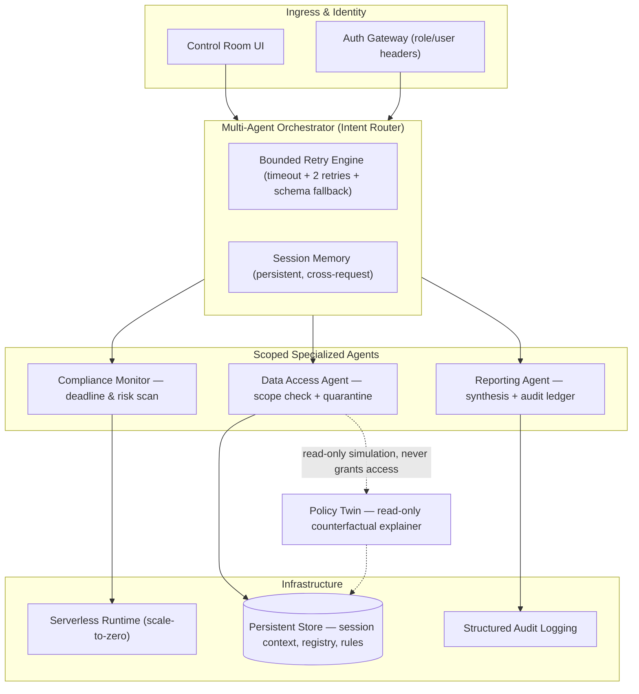

# SentinelMesh

**A multi-agent enterprise governance control plane — built for institutions that need enterprise-grade oversight on zero enterprise budget.**

SentinelMesh gives resource-constrained organizations (a campus research lab juggling grant compliance, IRB deadlines, and cross-PI data access is the reference deployment) a governed, observable, and safely-degrading layer for running specialized AI agents against real institutional data — without ever letting a language model make the final call on privilege escalation.

---

## Why SentinelMesh exists

Most "agentic" systems fail in one of three boring, predictable ways:

1. A model produces malformed output and something downstream silently acts on garbage.
2. A model is trusted to reason about its own permissions, and a cleverly-worded prompt talks it into overreaching.
3. A single failure cascades because there's no bounded retry, no fallback, and no audit trail to explain what happened.

SentinelMesh is built around the opposite defaults: **schema validation before action, deterministic (non-LLM) authorization, bounded retries with safe fallback, and a full audit trail for every decision.**

---

## Core capabilities

- **Agent Registry** — a live, versioned catalog of every active agent, its declared scope, and its available tools, exposed via a simple read API.
- **Session Memory** — persistent, cross-request context that survives restarts, so agents don't lose state between interactions.
- **Scoped Sub-Agents** — each specialized agent (compliance monitoring, data access, reporting) operates inside a hard-walled tool scope it cannot exceed, regardless of what it's told.
- **Model Armor** — inbound instruction text is scanned and quarantined for injection patterns *before* it ever reaches the model. Authorization decisions are made in plain Python, never inferred by the LLM.
- **Policy Twin** — a read-only, non-executable counterfactual explainer that lets a human operator ask "why was this denied?" without granting access or triggering a real tool call.
- **Bounded Failure Recovery** — every model call is wrapped in a retry envelope (max 2 attempts, corrective re-prompting) that degrades to a safe, schema-valid default instead of crashing or hallucinating a result.
- **Structured Observability** — a single authenticated ingress, rate-limiting, and OpenTelemetry-compliant structured logs for every agent action.

---

## Architecture



---

## System guarantees

| Pillar | Guarantee | Where it lives |
|---|---|---|
| **Agent Registry** | Every agent's identity, version, and scope is discoverable, not assumed | `GET /registry` |
| **Runtime & Memory** | Agent state persists across restarts and requests | Orchestrator `Runner` + persistent session store |
| **Isolation & Model Armor** | Sub-agents cannot exceed their declared tool scope; instruction text is sanitized before the model sees it; authorization is decided in code, not by the LLM | Scoped tool definitions + pattern scanner |
| **Observability** | Every request is authenticated, rate-limited, and traceable end to end | `require_api_key` middleware + `GET /observability` |
| **Failure Handling** | The system never silently acts on invalid output and never crashes on model failure | Bounded retry + schema-valid fallback wrapper |

---

## Getting started

```bash
# 1. Configure environment
export PROJECT_ID="your-project-id"
export REGION="us-central1"
export API_KEY="$(openssl rand -hex 24)"
export MODEL="your-model-name"

# 2. Authenticate
gcloud auth login
gcloud auth application-default login
gcloud config set project "$PROJECT_ID"

# 3. Install dependencies
cd gcp/sentinelmesh
python -m venv .venv
source .venv/bin/activate   # Windows: .venv\Scripts\Activate.ps1
pip install -r requirements.txt

# 4. Seed the data store (agent registry, compliance items, access rules)
python seed_firestore.py

# 5. Deploy
chmod +x deploy.sh
./deploy.sh
```

---

## Design principles we learned the hard way

- **Schema validation is the real safety boundary.** A timeout is recoverable. Acting on malformed structured output as if it were valid is not — every model output is validated before it's persisted or acted on.
- **Bounded retry beats infinite drift.** Exactly two corrective retries, then a safe schema-valid fallback. No infinite loops, no silent failure.
- **Authorization must be deterministic.** A language model should never be the thing deciding whether privilege escalation is allowed. Suspicious instruction patterns are quarantined *before* the model runs, and scope enforcement lives entirely in code.
- **Give operators a way to ask "why," not just "no."** The Policy Twin lets a human explore a denied action's reasoning without ever executing it or granting real access.

---

## Project structure

```
gcp/sentinelmesh/
├── main.py          # Orchestrator, agents, retry engine, API surface
├── policy.py         # Model Armor scanner + Policy Twin
├── seed_firestore.py # Registry / rules bootstrap
├── deploy.sh          # Deployment script
└── requirements.txt
```

---

## License

Add your preferred license here (MIT/Apache-2.0 recommended for open-source distribution).
