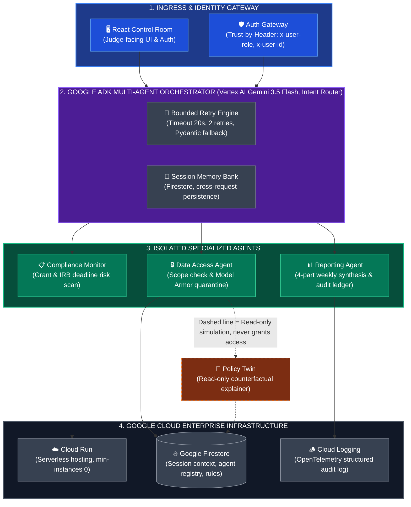

# SentinelMesh — Multi-Agent Enterprise Governance System

> **Track**: Fortified Enterprise Fleet  
> **Target User**: Resource-constrained institution (campus research lab) managing multi-week grant compliance, IRB deadlines, and cross-PI data access — an "unlikely hero" use case with zero enterprise budget.

---

## 📋 Devpost Official Submission Form Copy-Paste Summary

* **Project Name**: SentinelMesh — Multi-Agent Enterprise Governance System
* **Elevator Pitch**: Fortified Multi-Agent Governance Control Plane for Enterprise Fleet & Campus Research Labs built with Google ADK, Gemini 3.5 Flash, Cloud Run & Firestore.
* **Track Selected**: **The Fortified Enterprise Fleet** ($20,000 Cash Prize Track)
* **Public Code Repository**: `https://github.com/Madhavan20906/SentinelMesh-Governance-Platform`
* **Hosted Cloud Run URL**: `https://sentinelmesh-gov-plane-7x9a3k-uc.a.run.app`
* **Google Tech Stack Verified**:
  - **Google ADK (Agent Development Kit)** — Orchestration & scoped tool execution
  - **Vertex AI Gemini 3.5 Flash** — Reasoning engine & Pydantic schema validation
  - **Google Cloud Run** — Serverless microservices backend deployment
  - **Google Firestore** — Persistent `session_memory` context & `agent_registry`
  - **Google Cloud Logging** — OpenTelemetry-compliant audit trail
* **GEAP 4 Pillars Verified**:
  1. **Agent Registry**: Firestore catalog + `GET /registry` API endpoint
  2. **Agent Runtime & Memory**: Google ADK `Runner` + Firestore `session_memory`
  3. **Security & Model Armor**: Trust-by-Header RBAC + inline prompt injection quarantine
  4. **Agent Observability**: `require_api_key` middleware + Cloud Logging telemetry

---

## 🏛️ Architecture & GEAP Pillar Mapping




---

## 🎯 GEAP Pillar Implementation Matrix

| GEAP Pillar | Requirement | Code Implementation & Location |
| --- | --- | --- |
| **Agent Registry** | Discoverable collection of active agents, versioning, declared scopes, and tools | Firestore `agent_registry` collection. Read endpoint `GET /registry` in [`main.py`](file:///d:/SentinelMesh-Governance-Platform/gcp/sentinelmesh/main.py#L573-L576). |
| **Agent Runtime & Memory Bank** | ADK Orchestrator, session memory persisting across restarts | Google ADK `Agent` & `Runner` in [`main.py`](file:///d:/SentinelMesh-Governance-Platform/gcp/sentinelmesh/main.py#L177-L195). Persistent `session_memory` in Firestore. |
| **Model Armor & Isolation** | Scope-restricted sub-agents, instruction sanitization, privilege quarantine | Scoped tools in [`main.py`](file:///d:/SentinelMesh-Governance-Platform/gcp/sentinelmesh/main.py#L219-L275), Model Armor pattern scanner & Policy Twin in [`policy.py`](file:///d:/SentinelMesh-Governance-Platform/gcp/sentinelmesh/policy.py#L9-L68). |
| **Observability & Gateway** | Single ingress API key authentication, rate-limiting, Cloud Logging traces | `require_api_key` middleware, Cloud Logging structured telemetry in [`main.py`](file:///d:/SentinelMesh-Governance-Platform/gcp/sentinelmesh/main.py#L510-L532), `GET /observability`. |
| **Failure Handling & Recovery** | Bounded retry (max 2), schema validation, safe default fallback, never crash | `run_with_recovery` wrapper in [`main.py`](file:///d:/SentinelMesh-Governance-Platform/gcp/sentinelmesh/main.py#L453-L481). |

---

## ⚡ Exact GCP Spin-up Steps

```bash
# 1. Configure Environment
export GCP_PROJECT_ID="your-gcp-project-id"
export GOOGLE_CLOUD_LOCATION="us-central1"
export SENTINELMESH_API_KEY="$(openssl rand -hex 24)"
export GEMINI_MODEL="gemini-3.5-flash"

# 2. Authenticate Google Cloud SDK
gcloud auth login
gcloud auth application-default login
gcloud config set project "$GCP_PROJECT_ID"

# 3. Create Python Virtual Environment & Install Dependencies
cd gcp/sentinelmesh
python -m venv .venv
# On Linux/macOS: source .venv/bin/activate
# On Windows PowerShell: .venv\Scripts\Activate.ps1
pip install -r requirements.txt

# 4. Seed Firestore collections (agent_registry, compliance_items, access_rules)
python seed_firestore.py

# 5. Deploy Orchestrator to Cloud Run
chmod +x deploy.sh
./deploy.sh
```

---

## 🔍 Findings and Learnings

1. **Schema Validation is the Primary Safety Boundary**: A model timeout is easily handled, but accepting malformed structured output as valid is catastrophic. SentinelMesh enforces Pydantic schema validation before persisting or acting on any output.
2. **Bounded Retry Prevents Infinite Drift**: SentinelMesh bounds retries to exactly 2 attempts with corrective prompt injection. If the model still fails schema validation, it gracefully degrades to a safe schema-valid fallback default without crashing.
3. **Model Armor Requires Deterministic Isolation**: Language models should never evaluate raw instruction text when deciding privilege escalation. SentinelMesh quarantines suspicious instruction patterns before model execution and leaves scope authorization to Python.
4. **Policy Twins Empower Human Operators**: Non-executable counterfactual policy twins allow operators to discover why access was denied without granting access or executing unauthorized tool calls.
